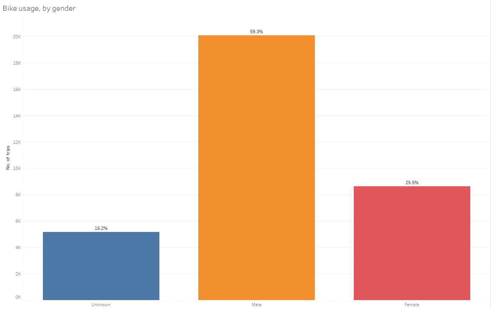
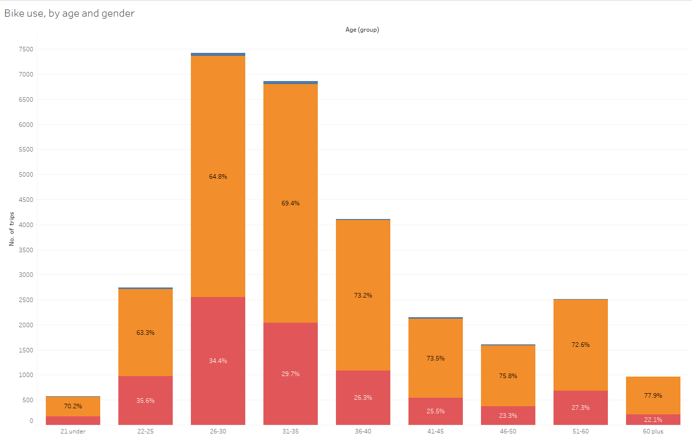
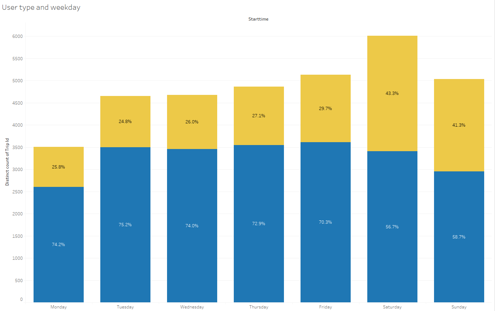
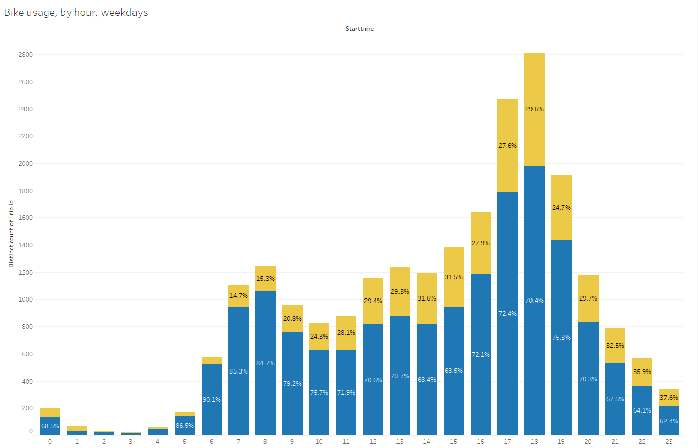
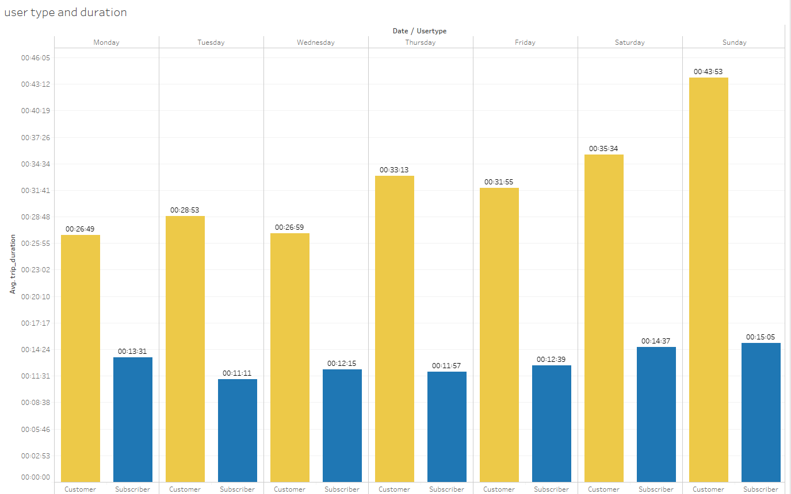
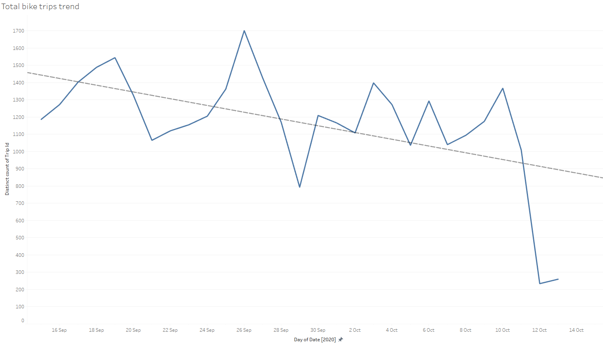

# Tableau Homework - Citi Bike Analytics

### Before You Begin

* This assignment will be saved to your Tableau Public account rather than GitHub. 

* If you haven't already, be sure to create a Tableau Public account [here](https://public.tableau.com/s/).

* The free tier of Tableau only lets you save to their public server. This means that each time you save your file it will be uploaded to your Tableau Public profile. 

* You are able to load and continue working on the same workbook.

* When you are finished with your assignment, you will turn in the URL to your Tableau Public workbook along with any additional files used for your analysis. 

## Background

Congratulations on your new job! As the new lead analyst for the [New York Citi Bike](https://en.wikipedia.org/wiki/Citi_Bike) Program, you are now responsible for overseeing the largest bike sharing program in the United States. In your new role, you will be expected to generate regular reports for city officials looking to publicize and improve the city program.

Since 2013, the Citi Bike Program has implemented a robust infrastructure for collecting data on the program's utilization. Through the team's efforts, each month bike data is collected, organized, and made public on the [Citi Bike Data](https://www.citibikenyc.com/system-data) webpage.

However, while the data has been regularly updated, the team has yet to implement a dashboard or sophisticated reporting process. City officials have a number of questions on the program, so your first task on the job is to build a set of data reports to provide the answers.

## Submission 

Your final submission should include:

* A link to your Tableau Public workbook that includes: 
  * 4-10 Total "Phenomenon" Visualizations 
  * 2 Dashboards
  * 1 City Official Map
  * 1 Story 
* A text or markdown file with your analysis on the phenomenons you uncovered from the data.

## Steps
1. Downloaded Jersey City csv data from https://www.citibikenyc.com/system-data
2. Cleaned and pre-processed data in Jupyter Notebook, creating columns such as unique trip ID
3. Exported cleaned and reformatted data as a new csv files
4. Imported reformatted csv files and joined on trip ID, creating measures, groups, calculated fields and aliases
5. Created visualisations and story in Tableau

## Insights
Set out to explore three main questions
1. What are the characteristics of the Citi Bike Program users? Which groups make the most trips?

* Bike users are overwhelmingly male

* We can observe this severe gender imbalance in every age bracket

* Bike users also tend to be aged in their mid-twenties to mid-thirties

2. How does usage change by user type (casual customers vs subscribers) and by time of day and weekday?

* Usage builds throughout the week and spikes on Saturdays

* During the working week, we can observe a small morning peak-hour spike in usage, and a large evening spike.

* Both on weekdays and weekend customers (casual users) tend to take longer trips compared to subscribers.
The generally lower proportion of customers during weekdays and commuting times, as well as the longer trip duration suggests 
many subscribers are using Bikeshare for regular commuting and transportation, whilst customers may be using bikes for leisure activities.

3. How has usage changed over the period observed?

* Usage has trended downwards over the period observed, falling sharply on October 12, 2020. This was likely due to severe bad weather caused by the remnants of Hurrican Delta. 
To get a clearer picture of a larger trends we should do a yeay-on-year comparison to account for seasonality. A further complicating factor is trying to assess the effect of Covid on bikeshare use. Analysing both seasonality through year on year comparisons, combined with covid data, would be an excellent extension of this assignment.

### Copyright

Data Boot Camp © 2019. All Rights Reserved.
